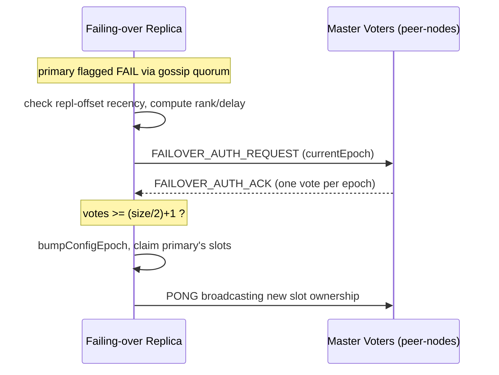

The sharding and membership subsystem: it splits the keyspace into 16,384 hash slots assigned across nodes, decides where each command belongs, and keeps the cluster's view of itself consistent through a gossip protocol. Two intertwined jobs — **command routing** (key → slot → owning node, with MOVED/ASK redirects) and **membership & consensus** (gossip, failure detection, epochs, failover) — both reading and mutating the shared `clusterState` and both paced by `clusterCron()`.

## Responsibilities
- **Route by slot** — `keyHashSlot()` maps a key (honoring `{hashtag}`) to one of `CLUSTER_SLOTS` (16384) slots; `getNodeByQuery()` resolves the owning node and returns a redirect decision, which `clusterRedirectClient()` turns into `-MOVED`, `-ASK`, `-CROSSSLOT`, or `-CLUSTERDOWN`
- **Answer introspection** — `clusterCommand()` serves `CLUSTER NODES`/`SLOTS`/`SHARDS`/`INFO`/`KEYSLOT` from cluster state
- **Gossip membership** — `clusterSendPing()` broadcasts PING/PONG/MEET carrying node flags, slot bitmaps, and epochs; `clusterProcessPacket()` demuxes incoming bus messages (PING/PONG/MEET/FAIL/UPDATE/PUBLISH/failover-auth)
- **Detect failure** — a node missed past its timeout is flagged `PFAIL` (suspected); once a quorum of masters agree it becomes `FAIL` (confirmed) and a FAIL message is broadcast
- **Coordinate replica failover** — `clusterHandleSlaveFailover()` (replica-only) checks replication-offset recency, ranks replicas, requests votes from masters, and on winning promotes itself, bumping `configEpoch` to settle split-brain
- **Track slot migration** — `migrating_slots_to[]` / `importing_slots_from[]` drive `-ASK` redirects while slots move between nodes
- **Persist topology** — `clusterSaveConfig()`/`clusterLoadConfig()` round-trip `nodes.conf` so membership survives restart

## Key files
- `src/cluster.c` — the routing front end: slot hashing, `getNodeByQuery()` redirect engine, `clusterRedirectClient()`, and `CLUSTER` subcommand dispatch/introspection
- `src/cluster_legacy.c` — the gossip-bus implementation: `clusterNode`/`clusterState`/`clusterLink` structs, the `clusterMsg` wire protocol, `clusterCron()` pacemaker, failure detection, the failover election, and `nodes.conf` persistence
- `src/cluster.h`, `src/cluster_legacy.h` — constants (`CLUSTER_SLOTS`, `CLUSTER_PORT_INCR` = 10000), redirect codes, and the bus message structs

## Failover Election

How a replica takes over when its primary is declared `FAIL`:

## Dependencies
- **Inbound** — `command-keyspace` consults `getNodeByQuery()`/`clusterRedirectClient()` for every command's routing decision; the parent `redis-server`'s `serverCron` → `clusterCron()` drives all periodic cluster work
- **Outbound** — sends/receives cluster-bus messages over `event-loop-networking` (`clusterLink` TCP connections on the data port + 10000) to the external `peer-nodes`; coordinates promotion with `replication-engine`, which reports the offset and performs the actual role transition after an election; writes `nodes.conf` to disk

## Tech Stack
- C; CRC16 slot hashing with hash-tag support, the `clusterMsg` binary gossip protocol, `configEpoch`/`currentEpoch` for conflict resolution, a PFAIL→FAIL quorum failure detector, and the `nodes.conf` topology file
