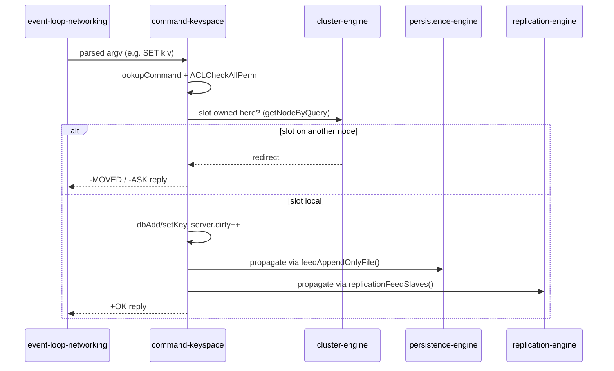

The execution core of the server: it resolves each parsed command against the command table, enforces ACL and access checks, and runs the type-specific handler that reads or mutates the in-memory keyspace. It is where Redis's data model actually lives — the databases, the polymorphic object model, key expiration, and every data-type command.

## Responsibilities
- **Resolve commands** — `lookupCommand()` finds a `redisCommand` in `server.commands` by name, carrying its arity, flags, key specs, ACL categories, and handler pointer; arity/existence are validated before dispatch
- **Enforce ACLs** — `ACLCheckAllPerm()`/`ACLCheckAllUserCommandPerm()` gate execution against the client's user, its command categories, and key/channel patterns
- **Own the keyspace API** — `lookupKeyRead()`/`lookupKeyWrite()`, `dbAdd`/`dbOverwrite`/`setKey`/`dbDelete`, and `selectDb()` operate over the `redisDb` (keys + expires kvstores); reads lazily evict via `expireIfNeeded()` and refresh LRU/LFU
- **Manage expiration** — `setExpire`/`getExpire` attach and read TTLs; the active-expiry sweep is driven from the parent's cron, lazy expiry happens here on access
- **Implement the data types** — string, list, set, hash, sorted-set, stream, and array commands in the `t_*.c` files, plus the bitmap (`bitops.c`), HyperLogLog (`hyperloglog.c`), and geo (`geo.c`) surfaces, each over a purpose-built encoding
- **Model values** — `object.c` defines `robj`/`kvobj` and their encodings (int, embstr/raw, listpack, intset, quicklist, hashtable, skiplist, stream) and handles refcounting and shared objects
- **Signal change** — mutations bump `server.dirty`, call `signalModifiedKey()` for `WATCH`, and emit `notifyKeyspaceEvent()` Pub/Sub messages; the dirty count is what tells the parent's `call()` to propagate

## Key files
- `src/db.c` — the keyspace/database API: lookups, writes, deletes, expiration, `SCAN`/`KEYS`, `selectDb`
- `src/object.c` — the `robj`/`kvobj` object model and encoding management
- `src/acl.c` — user/permission enforcement gating command execution
- `src/notify.c` — keyspace/keyevent notification emission
- `src/t_string.c`, `t_list.c`, `t_set.c`, `t_hash.c`, `t_zset.c`, `t_stream.c`, `t_array.c` — per-type command implementations (`bitops.c`, `hyperloglog.c`, `geo.c` extend the type surface)
- `src/commands.def` / `src/commands.c` — the generated command table (arity, flags, key specs, ACL categories) backing `lookupCommand`

## Write Command Lifecycle

How a write fans out to the durability and distribution subsystems once executed:

## Dependencies
- **Inbound** — `event-loop-networking` hands it the parsed argv; the parent `redis-server`'s `processCommand()`/`call()` orchestrate the actual dispatch
- **Outbound** — bumps `server.dirty` so `call()`/`propagateNow()` feed `persistence-engine` (AOF) and `replication-engine`; consults `cluster-engine` (`getNodeByQuery`) for slot routing and MOVED/ASK redirects; invokes `embedded-execution` when commands run Lua scripts, functions, or module handlers; publishes keyspace notifications over Pub/Sub

## Tech Stack
- C; the keyspace and types are built on internal structures: dict/kvstore (hash tables), sds strings, listpack and intset (compact encodings), quicklist (lists), skiplist (sorted sets), and rax (streams)
