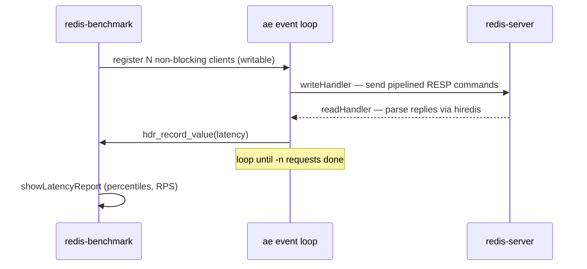

redis-benchmark is a standalone CLI binary that measures the throughput and latency of a redis-server by opening many concurrent connections and pipelining a configurable command mix at it. It owns load generation and latency reporting only — it is a client of the server, not part of the server process. It supports single-node, multi-threaded, and Redis Cluster benchmarking modes.

## Responsibilities
- Parse CLI options into a benchmark config (host/port/unix socket, client count `-c`, request count `-n`, pipeline depth `-P`, key/value sizes, command mix, CSV/quiet output)
- Open N non-blocking connections per benchmark and drive them all from a single `ae` event loop, multiplexing writes and reply reads
- Generate command payloads with `__rand_int__` / `{tag}` substitution, formatted via hiredis and replayed from a preformatted buffer each iteration
- Record per-request latency into an HDR histogram and report percentiles, mean/min/max, and requests-per-second per command tested
- Fan load out across worker threads when `--threads` is set, coordinating shared client state with pthread mutexes
- In cluster mode, discover the slot map via `CLUSTER NODES` / `CLUSTER SLOTS` and route each command to the node owning its key's slot

## Key files
- `src/redis-benchmark.c` — the entire tool: option parsing, the `client`/`benchmark`/`clusterNode` structs, the `writeHandler`/`readHandler` event callbacks, the latency-recording path, and the `showLatencyReport` / CSV output

## Benchmark client loop

## Dependencies
- **Inbound** — None at runtime. Invoked by the **Operator** from a shell as a standalone tool (e.g. `redis-benchmark -h 127.0.0.1 -p 6379 -c 50 -n 100000 -P 16`); nothing in the codebase calls into it.
- **Outbound** — Connects to **redis-server** over TCP, Unix socket, or TLS and drives it with RESP commands (the declared `RESP load test` edge). Links the bundled **hiredis** (`deps/hiredis`) for RESP formatting/parsing and connection setup, the in-tree **ae** event loop, **hdr_histogram** (`deps/hdr_histogram`) for latency percentiles, plus `adlist`, `dict` (cluster slot map), `sds`, `zmalloc`, `mt19937-64` (random key generation), and shared `cli_common.c` (TLS init, URI/arg parsing). Optional **OpenSSL** (`libhiredis_ssl`) when built with TLS.

## Tech Stack
- C; built by `src/Makefile` and linked against `../deps/hiredis/libhiredis.a` and `../deps/hdr_histogram/libhdrhistogram.a`
- Async I/O via the in-tree `ae` event loop (`aeCreateFileEvent`, `aeMain`); time events for periodic throughput updates
- hiredis for RESP (`redisFormatCommand`, `redisAppendCommand`, `redisGetReply`, non-blocking `redisConnectNonBlock`)
- HdrHistogram for microsecond-precision latency percentiles
- `pthread` for multi-threaded load generation; OpenSSL (optional) for `--tls`
