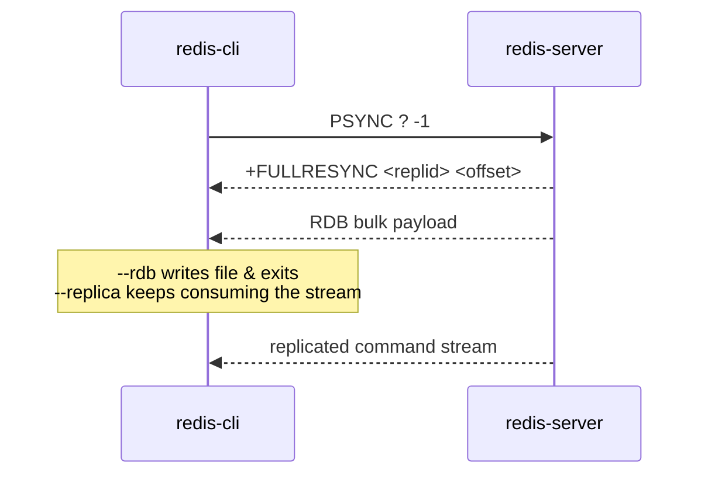

The command-line client for Redis. Beyond a REPL, it is a Swiss-army diagnostic and administration tool: it speaks RESP2/RESP3 to a server over TCP, Unix socket, or TLS, and bundles keyspace analysis, latency profiling, bulk loading, RDB dumping, and the full Redis Cluster manager.

## Responsibilities
- Run the interactive REPL — linenoise line editing, history, tab-completion, and live syntax hints sourced from `COMMAND DOCS` — or execute a single command from argv and exit
- Render replies in TTY-aware, `--raw`, `--csv`, or `--json`/`--quoted-json` form, and follow `MOVED`/`ASK` redirects in cluster mode (`-c`)
- Enter blocking modes for `SUBSCRIBE`/`PSUBSCRIBE` pub-sub and `MONITOR`, multiplexing incoming messages against the prompt
- Profile and observe a server: `--latency`/`--latency-dist`, `--stat` (rolling `INFO`), `--scan`, and `--bigkeys`/`--memkeys`/`--hotkeys`/`--keystats` sampling
- Bulk-load raw RESP from stdin (`--pipe`) and dump datasets via the replication protocol — `--rdb`, `--functions-rdb`, and `--replica` all issue `PSYNC ? -1` and consume the RDB/command stream
- Run and debug Lua with `--eval` and the `--ldb` interactive Lua debugger
- Administer Redis Cluster via `--cluster` subcommands: `create`, `check`, `info`, `fix`, `reshard`, `rebalance`, `add-node`/`del-node`, `set-timeout`, `import`, `call`, `backup`

## Key files
- `src/redis-cli.c` — the whole tool: option parsing, REPL, output formatting, the analysis modes, and the cluster-manager state machine
- `src/cli_common.c` — shared connection/TLS setup, ACL auth, and server-version detection (also used by other CLI tools)
- `src/cli_commands.c` — command metadata backing completion and hints
- `src/anet.c`, `src/ae.c`, `src/crc16.c`, `src/dict.c`, `src/adlist.c` — socket/keepalive helpers, the event loop used while sampling, hash-slot computation, and the structures holding cluster node state

## RDB Dump via Replication

`--rdb`/`--functions-rdb`/`--replica` obtain a dataset by impersonating a replica rather than issuing a normal command:

## Dependencies
- **Inbound** — invoked by the `operator` and `application-client` actors from a shell; not called by other components
- **Outbound** — a `redis-server` over RESP via hiredis. TCP/TLS (`redisConnect*`, optional OpenSSL upgrade) or Unix socket (`redisConnectUnix*`); cluster mode opens one connection per discovered node from `CLUSTER NODES`; `--rdb`/`--replica` ride the `PSYNC` replication stream

## Tech Stack
- C; entry point `src/redis-cli.c`
- Bundled `deps/hiredis` (RESP client + parser), `deps/linenoise` (line editing), `deps/hdr_histogram` (latency distribution); optional OpenSSL (`hiredis_ssl`) when built with `USE_OPENSSL`
