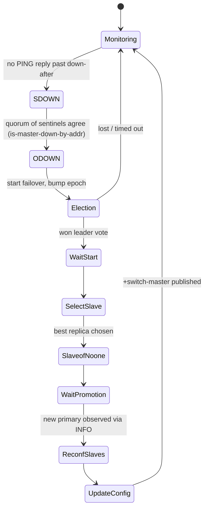

The Redis server binary run in sentinel mode (`redis-server --sentinel` / `redis-sentinel`), a distributed high-availability monitor. It owns failure detection and automatic failover: each sentinel periodically probes monitored primaries and replicas, agrees with peer sentinels on whether a primary is down, elects a leader via epoch-based voting, and then promotes a replica and reconfigures the rest to follow it — all without operator intervention.

## Responsibilities
- Probe every monitored instance with periodic `PING`/`INFO` and flag it subjectively down (`SRI_S_DOWN`) past `down-after-milliseconds` — `sentinelCheckSubjectivelyDown()` at [sentinel.c:4580](src/sentinel.c#L4580)
- Confirm primary failure across the sentinel quorum, marking it objectively down (`SRI_O_DOWN`) — `sentinelCheckObjectivelyDown()` and `sentinelAskMasterStateToOtherSentinels()` (the `SENTINEL is-master-down-by-addr` exchange) at [sentinel.c:4654](src/sentinel.c#L4654) and [sentinel.c:4734](src/sentinel.c#L4734)
- Run epoch-based leader election among sentinels — `sentinelVoteLeader()` / `sentinelGetLeader()` at [sentinel.c:4792](src/sentinel.c#L4792); only the elected leader proceeds with failover
- Drive the failover state machine through its six states (`WAIT_START → SELECT_SLAVE → SEND_SLAVEOF_NOONE → WAIT_PROMOTION → RECONF_SLAVES → UPDATE_CONFIG`) — `sentinelFailoverStateMachine()` at [sentinel.c:5374](src/sentinel.c#L5374)
- Pick the best replica to promote by priority, replication offset, and runid — `sentinelSelectSlave()` at [sentinel.c:5105](src/sentinel.c#L5105) — then issue `SLAVEOF NO ONE` and repoint the remaining replicas
- Discover peer sentinels and gossip configuration epochs over the `__sentinel__:hello` pub/sub channel — `sentinelSendHello()` / `sentinelProcessHelloMessage()` at [sentinel.c:3025](src/sentinel.c#L3025)
- Emit lifecycle events (`+sdown`, `+odown`, `+elected-leader`, `+switch-master`, …) for clients and admins, and fork user notification/reconfig scripts — `sentinelEvent()` at [sentinel.c:670](src/sentinel.c#L670)

## Failover state flow

## Key files
- `src/sentinel.c` — the entire implementation (~5.5k lines). Hot path: `sentinelTimer()` → `sentinelHandleRedisInstance()` ([sentinel.c:5422](src/sentinel.c#L5422)) per instance, the `sentinelCommand()` handler for the `SENTINEL` admin verbs, and the failover/election functions above.
- `sentinel.conf` — runtime config: `sentinel monitor <name> <ip> <port> <quorum>`, `down-after-milliseconds`, `failover-timeout`, `parallel-syncs`, `notification-script`, `client-reconfig-script`.
- `src/server.h` / `src/server.c` — sentinel reuses the server's event loop, command-table dispatch, and config machinery; the sentinel-mode flag and `sentinelRedisInstance` / `instanceLink` structures are declared alongside the core server.

## Dependencies
- **Inbound** — admins and clients via the `SENTINEL` command set (`MASTERS`, `REPLICAS`, `SENTINELS`, `GET-MASTER-ADDR-BY-NAME`, `FAILOVER`, `MONITOR`, `RESET`, `IS-MASTER-DOWN-BY-ADDR`, …), typically through [redis-cli](src/redis-cli.c); monitoring systems subscribe to the event channels (notably `+switch-master`) to learn the current primary.
- **Outbound** — monitored [redis-server](src/server.c) primaries and replicas over RESP via hiredis async connections (`PING`, `INFO`, `PUBLISH`/`SUBSCRIBE __sentinel__:hello`, `SLAVEOF`, `CONFIG REWRITE`); **peer sentinels** for quorum (`SENTINEL is-master-down-by-addr`) and discovery (the `__sentinel__:hello` gossip bus); the OS via `fork`/`exec` for notification and client-reconfig scripts.

## Tech Stack
- **C** — single-threaded, event-driven; no separate runtime from `redis-server`.
- **hiredis** — async RESP client (`redisAsyncContext`, `redisAsyncCommand`) for both the command link and the pub/sub link to each monitored instance.
- **ae** (`src/ae.c`) — the shared fd-multiplexing event loop driving `sentinelTimer()`.
- **anet** (`src/anet.c`) — TCP/Unix socket and name-resolution layer; optional TLS for instance links via OpenSSL.
